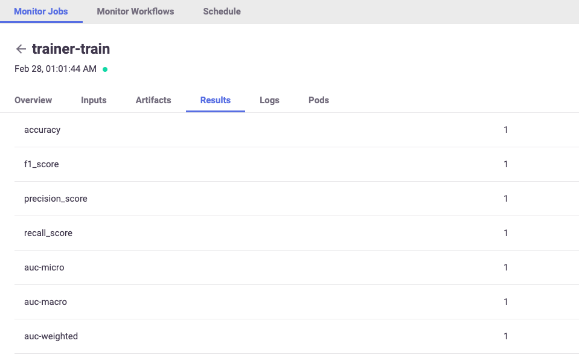

## Training with MLRun

First, we will load the project and run the data generation function `gen-iris` as we learned in the previous scenario:

```python
project = mlrun.load_project("./", init_git=True)
gen_data_run = project.run_function(
    "gen-iris", 
    params={"format": "csv"}, 
    local=True
)
```{{execute}}

Now, we wish to train a `RandomForestClassifier` model on our training data. For that, we wrote the following training 
function: `trainer.py`{{open}}

In the training function, you may spot the `apply_mlrun` function in line 30:

```python
...

# Apply MLRun's interface to the model, enabling logging the model and performing post training evaluation:
apply_mlrun(model=model, model_name="my_model", x_test=x_test, y_test=y_test)

...
```

As you can see, applying MLRun on the model object is very easy, and it's very effective. With it, we achieve automatic 
logging and distributed training while controlling the training from the MLRun function object. We will focus in this 
scenario on the automatic logging capabilities.

So, Let us run the training! Our training function is already set in the project, so all we need to do is use our dataset from the `gen_data_run` outputs:

```python
trainer_run = project.run_function(
    "trainer", 
    inputs={"dataset": gen_data_run.outputs["dataset"]}, 
    local=True
)
```{{execute}}

## MLRun's Automatic Logging

The auto-logging for SciKit-Learn includes many plots and metrics. The metrics and artifacts are chosen according to the 
model algorithm used (classification or regression). You are able to add more metrics and artifacts and even write your 
own. To learn more about choosing metrics, artifacts and adding custom ones, we suggest reading more on MLRun's docs.

Let us print the metrics results our model scored and the produced artifacts:

`pprint(trainer_run.outputs)`{{execute}}

You can check out the resutls and artifacts on the MLRun UI!




All of the metrics and artifacts, are stored as metadata of our model itself, so it will be easy to do comparison 
between models later on.
